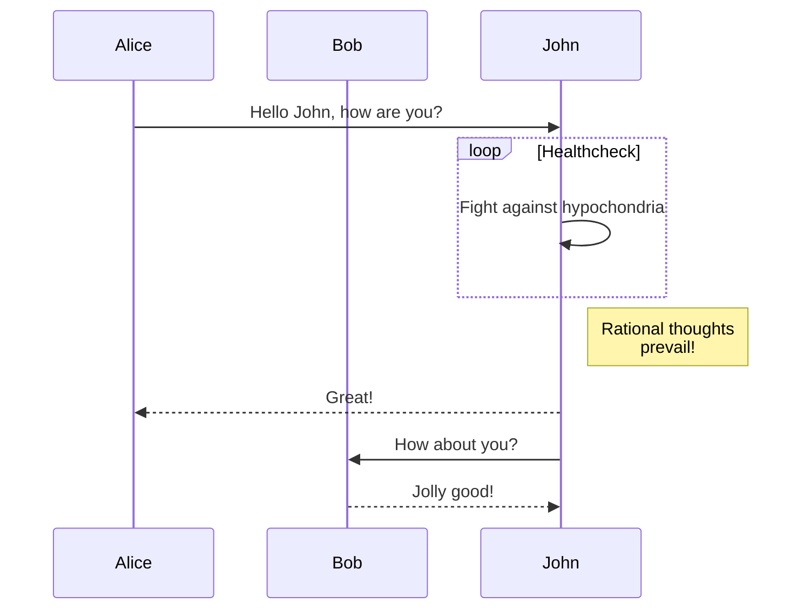

# Callout Component

A built-in component to show important information to the reader.

<!--more-->

> [!NOTE]
> [GitHub-style alerts](../../markdown#alerts) are supported since [v0.9.0](https://github.com/imfing/hextra/releases/tag/v0.9.0).
> It leverages Markdown syntax to render the callout which ensures better portability and readability of the content.

## Example


  A **callout** is a short piece of text intended to attract attention.



  A **callout** is a short piece of text intended to attract attention.



  A **callout** is a short piece of text intended to attract attention.



  A **callout** is a short piece of text intended to attract attention.


## Usage

### Default


  Hugo can be used to create a wide variety of websites, including blogs, portfolios, documentation sites, and more.


```markdown

  Hugo can be used to create a wide variety of websites, including blogs, portfolios, documentation sites, and more.

```

### Info


  Please visit GitHub to see the latest releases.


```markdown

  Please visit GitHub to see the latest releases.

```

### Warning


  This API will be deprecated in the next version.


```markdown

  A **callout** is a short piece of text intended to attract attention.

```

### Error


  Something went wrong and it's going to explode.


```markdown

  Something went wrong and it's going to explode.

```
# Cards Component

## Example


  
  
  



  
  
  


## Usage

```

  
  
  

```

```

  
  
  

```

## Card Parameters

| Parameter  | Description                                                     |
|----------- |-----------------------------------------------------------------|
| `link`     | URL (internal or external).                                     |
| `title`    | Title heading for the card.                                     |
| `subtitle` | Subtitle heading (supports Markdown).                           |
| `icon`     | Name of the icon.                                               |
| `tag`      | Text in tag.                                                    |
| `tagColor` | Color of the tag: `gray` (default), `yellow`, `red` and `blue`. |
  
## Image Card

Additionally, the card supports adding image and processing through these parameters:

| Parameter  | Description                                 |
|----------- |---------------------------------------------|
| `image`    | Specifies the image URL for the card.       |
| `method`   | Sets Hugo's image processing method.        |
| `options`  | Configures Hugo's image processing options. |

Card supports three kinds of images:

1. Remote image: the full URL in the `image` parameter.
2. Static image: use the relative path in Hugo's `static/` directory.
3. Processed image: use the relative path in Hugo's `assets/` directory.

Hextra auto-detects if image processing is needed during build and applies the `options` parameter or default settings (Resize, 800x, Quality 80, WebP Format).
It currently supports these `method`: `Resize`, `Fit`, `Fill` and `Crop`.

For more on Hugo's built in image processing commands, methods, and options see their [Image Processing Documentation](https://gohugo.io/content-management/image-processing/).

## Tags

Card supports adding tags which could be useful to show extra status information.


  
  
  
  
  


```

  
  
  
  

```

## Columns

You can specify the maximum number of columns for cards to span by passing the `cols` parameter to the `cards` shortcode. Note that columns will still be collapsed on smaller screens.


  
  



  
  


```

  
  



  
  

```

# Details

A built-in component to display a collapsible content.

<!--more-->

## Example



This is the content of the details.

Markdown is **supported**.





This will be hidden by default.



## Usage

````markdown
{}

This is the content of the details.

Markdown is **supported**.

{}
````

````markdown
{}

This will be hidden by default.

{}
````
# FileTree Component

## Example


  
    
    
      
      
      
    
  
  


## Usage

```text {filename="Markdown"}

  
    
    
      
      
      
    
  
  

```
# Icon

To use this shortcode inline, inline shortcode needs to be enabled in the config:

```yaml {filename="hugo.yaml"}
enableInlineShortcodes: true
```

List of available icons can be found in [`data/icons.yaml`](https://github.com/imfing/hextra/blob/main/data/icons.yaml).

<!--more-->

## Example






## Usage

```

```

[Heroicons](https://v1.heroicons.com/) v1 outline icons are available out of the box.

### How to add your own icons

Create `data/icons.yaml` file, then add your own SVG icons in the following format:

```yaml {filename="data/icons.yaml"}
your-icon: <svg>your icon svg content</svg>
```

It then can be used in the shortcode like this:

```



```

Tip: [Iconify Design](https://iconify.design/) is a great place to find SVG icons for your site.
# Jupyter Notebook Component

Experimental feature to include Jupyter Notebooks via a shortcode. Note that not all cell types are supported.

[Jupyter Notebook](https://jupyter.org/) is a language-agnostic HTML notebook application for [Project Jupyter](https://jupyter.org/). It allows you to create and share documents that contain live code, equations, visualizations, and narrative text.

<!--more-->

## How to use

### Using a local notebook

To use the Jupyter Notebook shortcode, you need to have a Jupyter Notebook file in your project. Similar to how you would [add images](../../organize-files#add-images) to the project, you can add Jupyter Notebooks to the `assets` folder.


  
    
  
  
    
        
    
  


Include the Jupyter Notebook in the page using the `jupyter` shortcode:

```markdown {filename="content/docs/my-page.md"}
---
title: My Page
math: true
---

{}
```

Alternatively, you can utilize the [page bundles][page-bundles] feature of Hugo to organize the Jupyter Notebooks together with the Markdown file.


  
    
        
            
            
        
    
  


```markdown {filename="content/docs/my-page/index.md"}
---
title: My Page
math: true
---

{}
```

### Using a remote notebook

You can also use a remote notebook by providing the URL to the notebook file. For example, to include [What is the Jupyter Notebook](https://github.com/jupyter/notebook/blob/main/docs/source/examples/Notebook/What%20is%20the%20Jupyter%20Notebook.ipynb) notebook in the page, you can use the following shortcode:

```
{{%/* jupyter "https://raw.githubusercontent.com/jupyter/notebook/main/docs/source/examples/Notebook/What%20is%20the%20Jupyter%20Notebook.ipynb" */%}}
```

## Example Notebook

The following is an example of a notebook file that is included in the project assets folder.

{}

[page-bundles]: https://gohugo.io/content-management/page-bundles/#leaf-bundles
# Other Shortcodes


  Some of these are Hugo built-in shortcodes.
  These shortcodes are considered less stable and may be changed anytime.


## Badge

```

```

Result:



Variants:

```



```

Result:

 &nbsp;
 &nbsp;


With link and icon:

```

```

Result:



## YouTube

Embed a YouTube video.

```

```

Result:



For more information, see [Hugo's YouTube Shortcode](https://gohugo.io/content-management/shortcodes/#youtube).

## PDF

With PDF shortcode, you can embed a PDF file in your content.

```

```

You can also place the PDF file in your project directory and use the relative path.

```

```

Example:


# Steps

A built-in component to display a series of steps.

## Example

{}

### Step 1

This is the first step.

### Step 2

This is the second step.

### Step 3

This is the third step.

{}


## Usage


  Please note that this shortcode is intended **only for Markdown content**.
  If you put HTML content or other shortcodes as step content, it may not render as expected.


Put Markdown h3 header within `steps` shortcode.

```
{}

### Step 1

This is the first step.

### Step 2

This is the second step.

{}
```
# Tabs

## Example



  **macOS**: A desktop operating system by Apple.
  **Linux**: An open-source operating system.
  **Windows**: A desktop operating system by Microsoft.



## Usage

### Default

```


  **JSON**: JavaScript Object Notation (JSON) is a standard text-based format for representing structured data based on JavaScript object syntax.
  **YAML**: YAML is a human-readable data serialization language.
  **TOML**: TOML aims to be a minimal configuration file format that's easy to read due to obvious semantics.


```

### Specify Selected Index

Use `defaultIndex` property to specify the selected tab. The index starts from 0.

```


  **JSON**: JavaScript Object Notation (JSON) is a standard text-based format for representing structured data based on JavaScript object syntax.
  **YAML**: YAML is a human-readable data serialization language.
  **TOML**: TOML aims to be a minimal configuration file format that's easy to read due to obvious semantics.


```

The `YAML` tab will be selected by default.



**JSON**: JavaScript Object Notation (JSON) is a standard text-based format for representing structured data based on JavaScript object syntax.
**YAML**: YAML is a human-readable data serialization language.
**TOML**: TOML aims to be a minimal configuration file format that's easy to read due to obvious semantics.




### Use Markdown

Markdown syntax including code block is also supported:

````


  
  ```json
  { "hello": "world" }
  ```
  

  ... add other tabs similarly


````



  
  ```json
  { "hello": "world" }
  ```
  

  
  ```yaml
  hello: world
  ```
  

  
  ```toml
  hello = "world"
  ```
  




### Sync Tabs

Tabs with the same list of `items` can be synchronized. When enabled, selecting a tab updates all other tabs with the same `items` and remembers the selection across pages.

Enable globally in your `hugo.yaml` under the `page` section:

```yaml {filename="hugo.yaml"}
params:
  page:
    tabs:
      sync: true
```

With this enabled the following two tab blocks will always display the same selected item:

```markdown


  A content
  B content





  Second A content
  Second B content


```


# Diagrams

Currently, Hextra supports [Mermaid](#mermaid) for diagrams.

<!--more-->

## Mermaid

[Mermaid](https://github.com/mermaid-js/mermaid#readme) is a JavaScript based diagramming and charting tool that takes Markdown-inspired text definitions and creates diagrams dynamically in the browser. For example, Mermaid can render flow charts, sequence diagrams, pie charts and more.

Using Mermaid in Hextra is as simple as writing a code block with language set `mermaid`:

````markdown

````

will be rendered as:


Sequence diagram:



For more information, please refer to [Mermaid Documentation](https://mermaid-js.github.io/mermaid/#/).

# Latex

By default, \(\KaTeX\) is used for rendering LaTeX math expressions.
No manual activation is needed, you can start using LaTeX math expressions in your Markdown content right away.

## Example

Both inline and separate paragraph LaTeX math expressions are supported in the Markdown content.

### Inline

```markdown {filename="page.md"}
This \(\sigma(z) = \frac{1}{1 + e^{-z}}\) is inline.
```

This \( \sigma(z) = \frac{1}{1 + e^{-z}} \) is inline.

### Separate Paragraph

```markdown {filename="page.md"}
$$F(\omega) = \int_{-\infty}^{\infty} f(t) e^{-j\omega t} \, dt$$
```

will be rendered as:

$$F(\omega) = \int\_{-\infty}^{\infty} f(t) e^{-j\omega t} \, dt$$

For example, using the aligned environment:

```latex {filename="page.md"}
$$
\begin{aligned}
  \nabla \cdot \mathbf{E} &= \frac{\rho}{\varepsilon_0} \\
  \nabla \cdot \mathbf{B} &= 0 \\
  \nabla \times \mathbf{E} &= -\frac{\partial \mathbf{B}}{\partial t} \\
  \nabla \times \mathbf{B} &= \mu_0 \left( \mathbf{J} + \varepsilon_0 \frac{\partial \mathbf{E}}{\partial t} \right)
\end{aligned}
$$
```

will be rendered as:

$$
\begin{aligned}
  \nabla \cdot \mathbf{E} &= \frac{\rho}{\varepsilon_0} \\
  \nabla \cdot \mathbf{B} &= 0 \\
  \nabla \times \mathbf{E} &= -\frac{\partial \mathbf{B}}{\partial t} \\
  \nabla \times \mathbf{B} &= \mu_0 \left( \mathbf{J} + \varepsilon_0 \frac{\partial \mathbf{E}}{\partial t} \right)
\end{aligned}
$$


## Configuration

> [!IMPORTANT]
> Please enable and configure the [passthrough extension](https://gohugo.io/content-management/mathematics/) in the Hugo configuration file, so that Hugo can detect LaTeX math expressions in your Markdown content.

```yaml {filename="hugo.yaml"}
markup:
  goldmark:
    extensions:
      passthrough:
        delimiters:
          block: [['\[', '\]'], ["$$", "$$"]]
          inline: [['\(', '\)']]
        enable: true
```

## Supported Functions

For a list of supported functions, see [KaTeX supported functions](https://katex.org/docs/supported.html).

## Chemistry

Chemistry expressions are supported via [mhchem](https://mhchem.github.io/MathJax-mhchem/) extension.

Inline: \(\ce{H2O}\) is water.

Separate paragraph:

```markdown {filename="page.md"}
$$\ce{Hg^2+ ->[I-] HgI2 ->[I-] [Hg^{II}I4]^2-}$$
```

will be rendered as:

$$\ce{Hg^2+ ->[I-] HgI2 ->[I-] [Hg^{II}I4]^2-}$$


## Math Engine

### MathJax

By default, [KaTeX][katex] is used for rendering LaTeX math expressions during the build process, which is preferred.
Alternatively, you can use [MathJax][mathjax] to render math expressions.

To use it instead, add the following to the configuration `hugo.yaml` file:

```yaml {filename="hugo.yaml"}
params:
  math:
    engine: mathjax
```

[katex]: https://katex.org/
[mathjax]: https://www.mathjax.org/

# Markdown

Hugo supports [Markdown](https://en.wikipedia.org/wiki/Markdown) syntax for formatting text, creating lists, and more. This page will show you some of the most common Markdown syntax examples.

<!--more-->

## Markdown Examples

### Styling Text

| Style   | Syntax     | Example   | Output   |
| --------  | -------- | ------ | ------ |
| Bold | `**bold text**` | `**bold text**` | **bold text** |
| Italic | `*italicized text*` | `*italicized text*` | *italicized text* |
| Strikethrough | `~~strikethrough text~~` | `~~strikethrough text~~` | ~~strikethrough text~~ |
| Subscript | `<sub></sub>` | `This is a <sub>subscript</sub> text` | This is a <sub>subscript</sub> text |
| Superscript | `<sup></sup>` | `This is a <sup>superscript</sup> text` | This is a <sup>superscript</sup> text |

### Blockquotes

Blockquote with attribution

> Don't communicate by sharing memory, share memory by communicating.<br>
> — <cite>Rob Pike[^1]</cite>

[^1]: The above quote is excerpted from Rob Pike's [talk](https://www.youtube.com/watch?v=PAAkCSZUG1c) during Gopherfest, November 18, 2015.

```markdown {filename=Markdown}
> Don't communicate by sharing memory, share memory by communicating.<br>
> — <cite>Rob Pike[^1]</cite>

[^1]: The above quote is excerpted from Rob Pike's [talk](https://www.youtube.com/watch?v=PAAkCSZUG1c) during Gopherfest, November 18, 2015.
```

### Alerts



Alerts are a Markdown extension based on the blockquote syntax that you can use to emphasize critical information.
[GitHub-style alerts](https://docs.github.com/en/get-started/writing-on-github/getting-started-with-writing-and-formatting-on-github/basic-writing-and-formatting-syntax#alerts) are supported.
Please make sure you are using the latest version of Hextra and [Hugo v0.146.0](https://github.com/gohugoio/hugo/releases/tag/v0.146.0) or later.

> [!NOTE]
> Useful information that users should know, even when skimming content.

> [!TIP]
> Helpful advice for doing things better or more easily.

> [!IMPORTANT]
> Key information users need to know to achieve their goal.

> [!WARNING]
> Urgent info that needs immediate user attention to avoid problems.

> [!CAUTION]
> Advises about risks or negative outcomes of certain actions.

```markdown {filename=Markdown}
> [!NOTE]
> Useful information that users should know, even when skimming content.

> [!TIP]
> Helpful advice for doing things better or more easily.

> [!IMPORTANT]
> Key information users need to know to achieve their goal.

> [!WARNING]
> Urgent info that needs immediate user attention to avoid problems.

> [!CAUTION]
> Advises about risks or negative outcomes of certain actions.
```

### Tables

Tables aren't part of the core Markdown spec, but Hugo supports them out-of-the-box.

|   Name | Age  |
|--------|------|
|    Bob | 27   |
|  Alice | 23   |

```markdown {filename=Markdown}
|   Name | Age  |
|--------|------|
|    Bob | 27   |
|  Alice | 23   |
```

#### Inline Markdown within tables

| Italics   | Bold     | Code   |
| --------  | -------- | ------ |
| *italics* | **bold** | `code` |

```markdown {filename=Markdown}
| Italics   | Bold     | Code   |
| --------  | -------- | ------ |
| *italics* | **bold** | `code` |
```

### Code Blocks


  


### Lists

#### Ordered List

1. First item
2. Second item
3. Third item

```markdown {filename=Markdown}
1. First item
2. Second item
3. Third item
```

#### Unordered List

* List item
* Another item
* And another item

```markdown {filename=Markdown}
* List item
* Another item
* And another item
```

#### Nested list

* Fruit
  * Apple
  * Orange
  * Banana
* Dairy
  * Milk
  * Cheese

```markdown {filename=Markdown}
* Fruit
  * Apple
  * Orange
  * Banana
* Dairy
  * Milk
  * Cheese
```

### Images


```markdown {filename=Markdown}

```

With caption:


```markdown {filename=Markdown}

```

For more advanced functionality, use Hugo's built-in [Figure shortcode](https://gohugo.io/shortcodes/figure/).

## Configuration

Hugo uses [Goldmark](https://github.com/yuin/goldmark) for Markdown parsing.
Markdown rendering can be configured in `hugo.yaml` under `markup.goldmark`.
Below is the default configuration for Hextra:

```yaml {filename="hugo.yaml"}
markup:
  goldmark:
    renderer:
      unsafe: true
  highlight:
    noClasses: false
```

For more configuration options, see Hugo documentation on [Configure Markup](https://gohugo.io/getting-started/configuration-markup/).

## Learning Resources

* [Markdown Guide](https://www.markdownguide.org/)
* [Markdown Cheatsheet](https://github.com/adam-p/markdown-here/wiki/Markdown-Cheatsheet)
* [Markdown Tutorial](https://www.markdowntutorial.com/)
* [Markdown Reference](https://commonmark.org/help/)


# Organize Files

## Directory Structure

By default, Hugo searches for Markdown files in the `content` directory, and the structure of the directory determines the final output structure of your website.
Take this site as an example:

<!--more-->


  
    
    
      
      
      
        
        
      
    
    
      
      
    
  


Each of the `_index.md` files is the index page for the corresponding section. The other Markdown files are regular pages.

```
content
├── _index.md // <- /
├── docs
│   ├── _index.md // <- /docs/
│   ├── getting-started.md // <- /docs/getting-started/
│   └── guide
│       ├── _index.md // <- /docs/guide/
│       └── organize-files.md // <- /docs/guide/organize-files/
└── blog
    ├── _index.md // <- /blog/
    └── post-1.md // <- /blog/post-1/
```

## Layouts

Hextra offers three layouts for different content types:

| Layout    | Directory             | Features                                                         |
| :-------- | :-------------------- | :--------------------------------------------------------------- |
| `docs`    | `content/docs/`       | Ideal for structured documentation, same as this section.        |
| `blog`    | `content/blog/`       | For blog postings, with both listing and detailed article views. |
| `default` | All other directories | Single-page article view without sidebar.                        |

To customize a section to mirror the behavior of a built-in layout, specify the desired type in the front matter of the section's `_index.md`.

```yaml {filename="content/my-docs/_index.md"}
---
title: My Docs
cascade:
  type: docs
---
```

The above example configuration ensures that the content files inside `content/my-docs/` will be treated as documentation (`docs` type) by default.

## Sidebar Navigation

The sidebar navigation is generated automatically based on the content organization alphabetically. To manually configure the sidebar order, we can use the `weight` parameter in the front matter of the Markdown files.

```yaml {filename="content/docs/guide/_index.md"}
---
title: Guide
weight: 2
---
```


  It is recommended to keep the sidebar not too deep. If you have a lot of content, consider **splitting them into multiple sections**.


## Section Navigation


### Section Pagination Order

The order in which pages, accessed via [`PAGE.PrevInSection`](https://gohugo.io/methods/page/previnsection/) and [`PAGE.NextInSection`](https://gohugo.io/methods/page/nextinsection/) in a [page collection](https://gohugo.io/quick-reference/glossary/#page-collection), are ordered, is reversed by default.

To disable this reversed ordering you can set the `reversePagination` custom parameter in the page front matter to `false`. By default `reversePagination` is set to `true`.

#### Example

Given the following directory structure:


  
    
    
      
      
        
        
          
        
        
          
        
        
          
        
      
    
  


And the following front matter in the posts:

```yaml {filename="content/blog/my-blog-series/post-a/index.md"}
---
title: Post A
weight: 1
---
```
```yaml {filename="content/blog/my-blog-series/post-b/index.md"}
---
title: Post B
weight: 2
---
```
```yaml {filename="content/blog/my-blog-series/post-c/index.md"}
---
title: Post C
weight: 3
---
```

If the reader is at the bottom of `post-b/index.md`, they will see that the next page is `post-a`, and the previous page is `post-c`. This is due to `reversePagination` being set to `true` by default. This is ok when we want our posts to be displayed in chronological order from latest to oldest. However, in the case of a blog series where there are multiple parts, we typically want people to read the first post, and then move to the second and so on. So we want to disable the reversed ordering.

We can turn off `reversePagination` in every blog post in this series by adding the following front matter to `my-blog-series/_index.md`

```yaml {filename="content/blog/my-blog-series/_index.md"}
---
title: My Blog Series
cascade:
    params:
        reversePagination: false
---
```

We are using [`cascade`](https://gohugo.io/content-management/front-matter/#cascade-1) here to propagate the setting to all posts in the `my-blog-series` so that `reversePagination` is set to `false` for all descendents. This will now ensure that when the reader is on `post-b/index.md` they will see that the next page is `post-c` and the previous page is `post-a`.

## Breadcrumb Navigation

Breadcrumbs are auto-generated based on the directory structure of `/content`.

For example, consider the file structure [demonstrated above](#directory-structure). Given that structure, the breadcrumbs atop the page at `/docs/guide/organize-files/` would appear automatically as follows:

```
Documentation > Guide > Organize Files
```

### Customizing Breadcrumb Link Titles

By default, each breadcrumb link is generated based on that page's `title` parameter. You can customize this by specifying a `linkTitle`.

For example, if instead of `Organize Files` we wanted the breadcrumb to be `Foo Bar`:

```yaml {filename="content/docs/guide/organize-files.md"}
---
linkTitle: Foo Bar
title: Organize Files
---
```

This would now generate the following breadcrumbs:
```
Documentation > Guide > Foo Bar
```

### Hiding Breadcrumbs

You can hide breadcrumbs completely from a page by specifying `breadcrumbs: false` in its front matter:

```yaml {filename="content/docs/guide/organize-files.md"}
---
breadcrumbs: false
title: Organize Files
---
```

## Configure Content Directory

By default, the root `content/` directory is used by Hugo to build the site.
If you need to use a different directory for content, for example `docs/`, this can be done by setting the [`contentDir`](https://gohugo.io/getting-started/configuration/#contentdir) parameter in the site configuration `hugo.yaml`.

## Add Images

To add images, the easiest way is to put the image files in the same directory as the Markdown file.
For example, add an image file `image.png` alongside the `my-page.md` file:


  
    
        
        
    
  


Then, we can use the following Markdown syntax to add the image to the content:

```markdown {filename="content/docs/my-page.md"}

```

We can also utilize the [page bundles][page-bundles] feature of Hugo to organize the image files together with the Markdown file. To achieve that, turn the `my-page.md` file into a directory `my-page` and put the content into a file named `index.md`, and put the image files inside the `my-page` directory:


  
    
        
            
            
        
    
  


```markdown {filename="content/docs/my-page/index.md"}

```

Alternatively, we can also put the image files in the `static` directory, which will make the images available for all pages:


  
    
        
    
  
  
    
        
    
  


Note that the image path begins with a slash `/` and is relative to the static directory:

```markdown {filename="content/docs/my-page.md"}

```

[page-bundles]: https://gohugo.io/content-management/page-bundles/#leaf-bundles

# Syntax Hilighting

Hugo uses [Chroma](https://github.com/alecthomas/chroma), a general purpose syntax highlighter in pure Go, for syntax highlighting.
It is recommended to use backticks for code blocks in Markdown content. For example:

<!--more-->

````markdown {filename="Markdown"}
```python
def say_hello():
    print("Hello!")
```
````

will be rendered as:

```python
def say_hello():
    print("Hello!")
```

## Features

### Filename

To add a filename or title to the code block, set attribute `filename`:

````markdown {filename="Markdown"}
```python {filename="hello.py"}
def say_hello():
    print("Hello!")
```
````

```python {filename="hello.py"}
def say_hello():
    print("Hello!")
```

### Link to File



You can use the `base_url` attribute to provide a base URL that will be combined with the file name to generate a link.

The file name can include a relative path if it specifies the file's location within the base path.

````markdown {filename="Markdown"}
```go {base_url="https://github.com/imfing/hextra/blob/main/",filename="exampleSite/hugo.work"}
go 1.20
```
````

```go {base_url="https://github.com/imfing/hextra/blob/main/",filename="exampleSite/hugo.work"}
go 1.20
```

### Line Numbers

To set line numbers, set attribute `linenos` to `table` and optionally set `linenostart` to the starting line number:

````markdown {filename="Markdown"}
```python {linenos=table,linenostart=42}
def say_hello():
    print("Hello!")
```
````

```python {linenos=table,linenostart=42}
def say_hello():
    print("Hello!")
```

### Highlighting Lines

To highlight lines, set attribute `hl_lines` to a list of line numbers:

````markdown {filename="Markdown"}
```python {linenos=table,hl_lines=[2,4],linenostart=1,filename="hello.py"}
def say_hello():
    print("Hello!")

def main():
    say_hello()
```
````

```python {linenos=table,hl_lines=[2,4],linenostart=1,filename="hello.py"}
def say_hello():
    print("Hello!")

def main():
    say_hello()
```

### Copy Button

By default, copy button is enabled for code blocks. Its behavior can changed by modifying the site configuration file:

```yaml {linenos=table,linenostart=42,filename="hugo.yaml"}
params:
  highlight:
    copy:
      enable: true
      # hover | always
      display: hover
```

## Supported Languages

For a list of supported languages, please see the [Chroma documentation](https://github.com/alecthomas/chroma#supported-languages).

